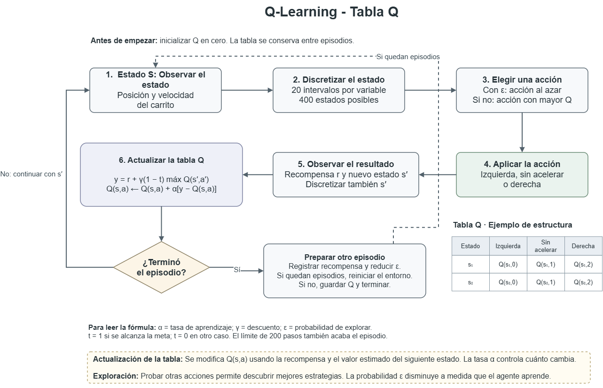
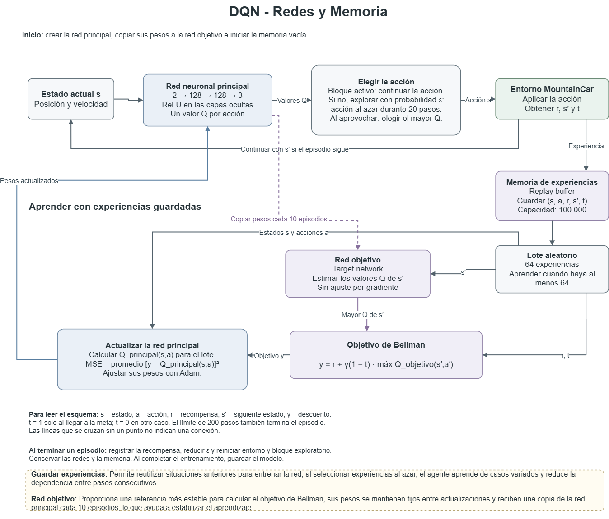

# MountainCar-v0 — Q-Learning tabular vs. Deep Q-Network (DQN)

Maestría en Inteligencia Artificial — Simulación y Aprendizaje por Refuerzo

Trabajo en equipo: implementación y comparación de dos enfoques de Aprendizaje
por Refuerzo para resolver el entorno [`MountainCar-v0`](https://gymnasium.farama.org/environments/classic_control/mountain_car/)
de Gymnasium — un agente de **Q-Learning tabular** (con discretización del
espacio de estados) y un agente de **Deep Q-Network (DQN)**.

Repositorio base del curso: [emiliomunozai/mountain_car](https://github.com/emiliomunozai/mountain_car)

## Equipo

| Persona | Responsabilidad |
|---|---|
| Persona 1- Maria Paula Arciniegas Longas | Repositorio, entorno y README (coordinación) |
| Persona 2- Camilo Andres Briceno Leon | Agente Q-Learning: código, entrenamiento y evidencia |
| Persona 3- Sabrina Anais Miranda Franco| Agente DQN: red neuronal y aprendizaje |
| Persona 4- Carlos Eduardo Caicedo Hortua| Agente DQN: exploración y resultados |
| Persona 5- Cesar Camilo Rojas Sarmiento| Esquemas propios (dibujos a mano) |
| Persona 6-Cesar Hernan Garcia Afanador | Documentación y comparación final |

## Objetivo

Entender las diferencias entre los métodos tabulares clásicos y el Deep RL,
analizando el proceso de entrenamiento, el desempeño obtenido y las
limitaciones de cada aproximación, sobre el mismo entorno.

## Estructura del repositorio

```
mountain_car/
├── src/mountain_car/
│   ├── cli.py
│   └── agents/
│       ├── qlearning.py   # Ejercicio 1: Q-Learning tabular
│       └── dqn.py         # Ejercicios 2 y 3: DQN
├── evidencias/
│   ├── qlearning/         # Curva/score del mejor resultado de Q-Learning
│   ├── dqn/                # Curva/score del mejor resultado de DQN
│   └── esquemas/           # Dibujos propios: ciclo de Q-Learning y de DQN
├── saves/                  # Agentes entrenados guardados
├── EXERCISES.md            # Enunciado original de los ejercicios (curso)
└── pyproject.toml
```

## Instalación y ejecución

El proyecto usa [`uv`](https://docs.astral.sh/uv/) para manejar el entorno y las dependencias.

```bash
uv sync                                   # instala el entorno y las dependencias
uv run mountaincar inspect --steps 3      # inspecciona el entorno
```

Comandos principales:

```bash
# Q-Learning
uv run mountaincar train qlearning --episodes 10000
uv run mountaincar load qlearning --eval
uv run mountaincar render qlearning --episodes 3

# DQN
uv run mountaincar train dqn --episodes 1000
uv run mountaincar load dqn --eval
uv run mountaincar render dqn --episodes 3
```

Otros comandos útiles: `list`, `init <agente>`, `sim <agente>`, `delete <agente>`.

## 1. Agente Q-Learning tabular


**Discretización:** `n_bins = 20` por dimensión (posición, velocidad) → 400 estados posibles.

**Hiperparámetros:**

| Hiperparámetro | Valor |
|---|---|
| `n_bins` | 20 |
| `lr` (α) | 0.1 |
| `gamma` (γ) | 0.99 |
| `epsilon_start` | 1.0 |
| `epsilon_end` | 0.01 |
| `epsilon_decay` | 0.9995 |
| Episodios de entrenamiento | 10.000 |

**Resultado del mejor agente:** score de evaluación **−149,30 ± 15,99** en 10 episodios (modo determinista), con **10/10 episodios exitosos** (llegó a la bandera). Estados visitados: 294 / 400.

**Evidencia:** ver [`evidencias/qlearning/`](evidencias/qlearning/)

**Comentario:** El agente resuelve el entorno de forma consistente: alcanza la bandera en las 10 evaluaciones. Durante el entrenamiento, la recompensa
promedio pasó de −200 (política aleatoria inicial) a un mejor tramo cercano a −130, y la política final quedó en torno a −149 en evaluación. La discretización 20×20 fue suficiente para capturar la dinámica de posición y velocidad. La ligera variabilidad (±15,99) es esperable en un método tabular con exploración residual (epsilon = 0,01) y una cuadrícula relativamente gruesa.


## 2. Agente Deep Q-Network (DQN)

**Arquitectura de la red:** MLP `state_dim → hidden → hidden → action_dim`

**Componentes:** replay buffer, target network, exploración con acciones
temporalmente correlacionadas (necesaria para que el agente logre secuencias
sostenidas de empuje y pueda escapar el valle — ver `EXERCISES.md`, Ejercicio 3).

**Hiperparámetros:**

| Hiperparámetro | Valor |
| --- | --- |
| Tamaño de capas ocultas | 2 capas de 128 neuronas, activación ReLU |
| Learning rate | 0.001 (optimizador Adam) |
| `gamma` (γ) | 0.99 |
| Tamaño del replay buffer | 100.000 transiciones |
| Tamaño de batch | 64 |
| Frecuencia de actualización de target network | cada 10 episodios |
| Epsilon | de 1.0 a 0.01, decaimiento de 0.995 por episodio |
| Función de pérdida | MSE (error cuadrático medio) |
| Hiperparámetros de exploración correlacionada | `pasos_exploracion = 20`: repetir la misma acción exploratoria durante 20 pasos; referencia con `pasos_exploracion = 1` |
| Episodios de entrenamiento | 2.500 por configuración, con semilla 42 |

**Resultado del mejor agente:** DQN con exploración correlacionada, seleccionado mediante validación en el episodio 1.750 de un entrenamiento completo de 2.500 episodios. Obtuvo un score medio de **−99,00** y **10/10 episodios exitosos** en las primeras diez evaluaciones. Estas forman parte de una evaluación de 100 episodios, cuyo resultado completo fue **−102,23 ± 12,59** (media ± desviación estándar) y **100/100 episodios exitosos**, sin exploración.

**Evidencia:** ver [evidencias/dqn/](evidencias/dqn/).

- [Informe completo](docs/Resultados_agente-dqn-exploracion-resultados.md).
- [Curvas de entrenamiento y validación](evidencias/dqn/comparacion_persona4/comparacion_aprendizaje.png).
- [Comparación de las cien evaluaciones](evidencias/dqn/comparacion_persona4/comparacion_evaluacion.png).
- [Resultados del agente con bloques](evidencias/dqn/bloques20_semilla42_2500/resultado.txt).
- [Registro y modelos del agente con bloques](evidencias/dqn/bloques20_semilla42_2500/).
- [Registro y modelos de la referencia](evidencias/dqn/independiente_semilla42_2500/).
- [Grabación de un episodio real](evidencias/dqn/demostracion_persona4/episodio.gif).

**Comentario:** Mantener una acción exploratoria durante 20 pasos facilitó secuencias sostenidas de empuje durante el entrenamiento. El agente logró llegar a la meta en todos los episodios evaluados, mientras que la referencia con exploración independiente obtuvo −200,00 y 0/100 llegadas. El parámetro `pasos_exploracion` se añadió a `_HPARAMS` para guardarlo y cargarlo con el modelo, y el estado de exploración se reinicia al comenzar cada episodio en `train()`. La repetición se aplica en `select_action` durante la exploración; la evaluación utiliza las decisiones de la red sin repetición forzada. Los resultados corresponden a una semilla de entrenamiento por configuración.

### Diagnóstico: por qué falla la exploración estándar (Ejercicio 3)

Antes de corregir la exploración, se verificó el funcionamiento de la red y se diagnosticó el problema:

| Prueba | Resultado |
|---|---|
| CartPole-v1 (200 episodios) | recompensa promedio de 20.68 (episodios 1-25) a 178.56 (episodios 176-200) |
| MountainCar-v0 (1000 episodios, exploración epsilon-greedy normal) | -200 en todos los episodios, 0 de 1000 llegaron a la bandera |
| Promedio de los valores Q en MountainCar | -63.53 |
| Diferencia promedio entre la mejor y la peor acción | 0.008 |


**Interpretación:** La red funciona (aprende bien en CartPole-v1), pero con exploración epsilon-greedy estándar el DQN no aprende en MountainCar. En los 1000 episodios nunca llegó a la bandera, así que solo recibió -1 en cada paso y nunca vio una recompensa diferente. La red termina dando casi el mismo valor Q a las tres acciones (la diferencia es de solo 0.008): para la red da igual ir a la izquierda, a la derecha o no hacer nada, porque como nunca llegó a la meta, nada de lo que hizo le dio un mejor resultado. Para subir la montaña, el carro tiene que empujar muchas veces seguidas hacia el mismo lado; pero al explorar al azar en cada paso casi nunca repite la misma acción. Esto se corrige con la exploración temporalmente correlacionada descrita arriba.


## 3. Esquemas del proceso de entrenamiento

### Q-Learning — tabla Q

El esquema muestra cómo el agente observa el estado, selecciona una acción, recibe una recompensa y actualiza el valor correspondiente en la tabla Q, la exploración permite probar otras acciones y descubrir mejores estrategias.



### DQN — redes y memoria

El esquema muestra la red principal, la memoria de experiencias, la red objetivo y la actualización de Bellman. La memoria permite reutilizar experiencias y seleccionar muestras al azar para entrenar, la red objetivo proporciona una referencia más estable para calcular los valores que la red principal aprende a estimar.




## 4. Comparación entre Q-Learning y DQN

| Aspecto | Q-Learning tabular | DQN |
|---|---|---|
| Estabilidad del entrenamiento | Curva de recompensa ruidosa; el promedio oscila incluso al final del entrenamiento | Más estable una vez incorporada la exploración correlacionada (±12,59 en 100 evaluaciones) |
| Velocidad de aprendizaje | Lenta: requirió 10.000 episodios para resolver el entorno | Más eficiente por episodio: buen desempeño hacia el episodio ~1.750 |
| Desempeño final | −149,30 ± 15,99; 10/10 llegadas a la bandera | −102,23 ± 12,59; 100/100 llegadas a la bandera |
| Ventajas | Simple y transparente (se puede inspeccionar la tabla); no requiere GPU | Mejor desempeño; generaliza a estados continuos sin necesidad de discretizar; escala mejor |
| Limitaciones | La discretización pierde precisión; no escala a espacios de estados grandes | Más complejo; sensible a los hiperparámetros; la exploración estándar falla en MountainCar |
| Dificultad de implementación | Baja (tabla + regla TD) | Alta (replay buffer, target network y arreglo de exploración) |

### Análisis

**Desempeño final.** El DQN obtuvo mejor puntaje (−102 frente a −149) y resolvió
el entorno en el 100% de las evaluaciones. Ambos métodos aprenden a llegar a la
bandera, pero el DQN lo hace de forma más eficiente porque aproxima el valor de
estados continuos en vez de dividirlos en casillas.

**Estabilidad.** El Q-Learning tabular muestra una curva de recompensa ruidosa
que oscila incluso al final del entrenamiento, propio de un método con una
cuadrícula gruesa y exploración residual. El DQN, una vez ajustada la
exploración, entrega resultados más consistentes (±12,59).

**Velocidad de aprendizaje.** El Q-Learning necesitó 10.000 episodios; el DQN
alcanzó buen desempeño hacia el episodio ~1.750. Conviene matizar que los
episodios no son directamente comparables: cada episodio de DQN es más costoso
(entrena una red neuronal), pero la red generaliza lo aprendido en un estado a
los estados vecinos, mientras que la tabla debe visitar cada casilla por
separado.

**El punto clave del DQN.** Con exploración aleatoria por paso el DQN no aprende
en MountainCar: para subir la loma hay que empujar de forma sostenida, y repetir
la misma acción muchos pasos al azar es casi imposible (probabilidad ≈ (1/3)^20).
La solución fue usar exploración correlacionada (repetir la acción varios pasos),
lo que permitió que emergiera el movimiento de "vaivén" necesario para escapar
del valle.

**Ventajas, limitaciones y dificultad.** El Q-Learning es más simple y
transparente, pero no escala a espacios de estados grandes y depende de una
buena discretización. El DQN escala mejor y da mejor desempeño, a costa de mayor
complejidad (replay buffer, red objetivo) y de ser más sensible a los
hiperparámetros y a la estrategia de exploración.

**Conclusión.** Para un problema pequeño y discretizable como MountainCar, el
Q-Learning tabular es suficiente y muy didáctico; el DQN ofrece mejor desempeño
y es el camino cuando el espacio de estados es grande o continuo, siempre que se
cuide la exploración.

## Referencias

- Sutton, R. S., & Barto, A. G. (2018). *Reinforcement Learning: An Introduction* (2.ª ed., caps. 4–6). MIT Press.
- Documentación de [Gymnasium — MountainCar-v0](https://gymnasium.farama.org/environments/classic_control/mountain_car/).
- Lapan, M. (2020). *Deep Reinforcement Learning Hands-On* (2.ª ed.). Packt.
git config --global user.name "Maria Paula Arciniegas"
git config --global user.email "arciniegasmariapaula@gmail.com"
